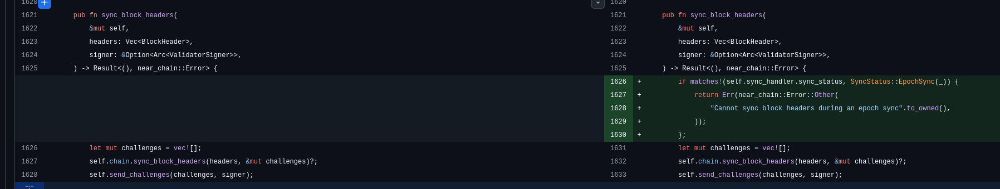
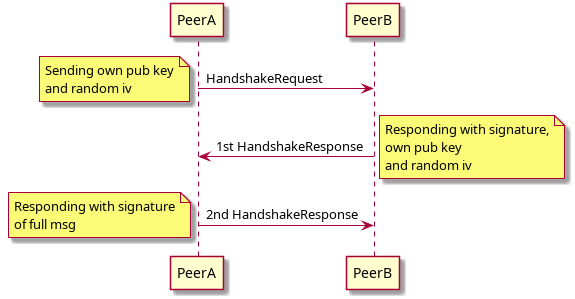

# LearnCoin

The personal palyground for making mistakes and project-backed experiments in Rust

## Short history

Initially the project ought to be just a short-lived teaser for exploring some basic blockchain concepts and getting used to Rust.
While contributing to commercial or open source projects, sometimes I felt like I'm fighting with a framework, that some pieces of the puzzle are missing or maybe I or I just would like to try something new (for me) and see the consequences as they grow.

It might be as little as:

- aadopting design pattern that feels more natural
- using a neat macro to eliminate boilerplate code
- or simply getting comfortable with Rust’s async framework

or as big as:

- designing my own fuzzing-friendly test loop
- or integrating the project with the EVM.

There are no strict boundaries. The central theme is to experiment while continuously raising sophistication of the project.

Please Note: All direct or indirect references to other projects serve just as a mean to explain why I would like to explore the subject and learn from it.

## Leading goals as of March 2026

### Traiting out a protocol infrastructure

I’ve had plenty of opportunities to extend legacy systems with new capabilities.
We are typically given a list of inputs, a description of the desired outputs (or effects), a set of conditions, and an activation flag.
Without much hesitation, we turn these into new code branches.
As the project grows, it becomes increasingly difficult to understand:

- how data actually flows through the system,
- whether the host or a peer is making changes,
- what are interactions between features,
- or what is causing modifications to my state.

As an example lets take a quick look of my
[minor contribution](https://github.com/near/nearcore/pull/12868/changes/2d9d217faa81688b059891b07385a818a8aa257b)
to the [NEARcore](https://github.com/near/nearcore) project from early 2025:



The commit only adds a simple guard: if EpochSync is being processed, BlockHeaders should not be synced.
What we are actually dealing with here are two asynchronous and mutually incompatible protocols running in parallel.
The relevant code is event-driven — a message arrives, and a sync (either Epoch or Header) is processed leaving limited evidence,
such as the current variant of sync_status: SyncStatus in the sync_handler.

In other words, a protocol like HeaderSync must be aware of other protocols and branch its logic accordingly to handle relevant interactions.

What if we could design a system where protocols are “other-protocols-agnostic”?
Could the responsibility for managing inter-protocol interactions be shifted to a higher-level entity that has the power to start, restart, or cancel flows?

That is current idea behind exploring protocols management.
Starting simple with a made-up handshake protocol:

> Two `Peer`s exchange thier ids (i.e. their public keys) and prove that they are in possession of the private key



That simple protcol already provides meaningful insights. A protocol, at its very minimum, needs

- some local context (`self` used here, but some generic `Context` type could be too)
- some way of communicating with outside world (`P2PMessanger` - wrapping a real comm means or a Mock)
- (todo!) some way of cummunicating with owning `Clinet`

```rust
pub trait TwoPartyExchange {
    async fn initiate(self, messanger: impl P2PMessenger);
    async fn accept(self, messanger: impl P2PMessenger);
}
```

That approach already suggest (but don't forbids) that potential interactions/collisions should be managed, elsewhere.
As an example the management, basic properties and much more could be derived

```rust
#[derive(Protocol)]
#[requests(timeout = 100ms, repeat = 5)]
#[cancel_on = [self, BlackListUpdateProtocol, ...]]
#[ignore_if = [...]]
pub struct HandshakeProtocol {
    local_peer: Peer,
}
```

### Protocols lesson 1:

When trying to abstract out the `P2PMessenger` I kept falling the same trap over and over again:

> The connected Peer is the Peer that made through a handshake procedure

At first it seems logical, why to talk with the guy if we do not know each other?
But the problem is, how to handle P2P communication? Should I make some separation of the two kids of Peers like in [Separation of Connected/Pending Peers](https://github.com/mkamonMdt/learn_coin/commit/1a20dfc89276b5cba5233cf56d4ad83130512d45) ?

```rust
#[derive(Clone)]
struct Peers {
    connected: Arc<Mutex<HashMap<String, Peer>>>,
    pending: Arc<Mutex<HashMap<String, PendingPeer>>>,
}
struct PendingPeer {
    addr: String,
    writer: OwnedWriteHalf,
}
```

Then I could just pass a `Writer` handle onced a Peer is connected to `Client`

```rust
#[derive(Debug)]
pub enum NodeEvent {
    PeerConnected(Peer, tokio::net::tcp::OwnedWriteHalf),
    PeerDisconnected(String),
    NetworkMessage { peer_id: String, message: Vec<u8> },
}
```

But how I would handle repeated messages in the `Handshake` protocol? Smells like an if inside the protocol trying to manage outside conditions.
So the resolution is fairly simple: Just make the protocol layer to handle protocols and the communication layer to handle communication.

Communication layer runs a deamon dispatcher

```rust
async fn backend_deamon(
    stream: TcpStream,
    mut outgoing_rx: mpsc::Receiver<NetworkMessage>,
    mut register_rx: mpsc::Receiver<ProtocolCmd>,
) {
    let mut protocol_registry: HashMap<ProtocolId, mpsc::Sender<NetworkMessage>> = HashMap::new();
    let (mut reader, mut writer) = stream.into_split();
    loop {
        tokio::select! {
            Some(payload) = outgoing_rx.recv() => {
                let _ = writer.send(payload).await;
            }
            Ok(incomming) = reader.recieve()=> {
                if let Some(tx) = protocol_registry.get(&incomming.protocol_id) {
                    let _ = tx.send(incomming).await;
                }
            }
            Some(cmd) = register_rx.recv() => {
                match cmd {
                    ProtocolCmd::Open(protocol_id, sender) => {protocol_registry.insert(protocol_id, sender);
                    }
                    ProtocolCmd::Close(protocol_id) =>{ protocol_registry.remove(&protocol_id);}
                }

            }
        }
    }
}
```

Protocol layer calls node for a new Protocol Handle

```rust
async fn handle_network_event(local_peer: Peer, node: Arc<Node>, event: NodeEvent) {
    match event {
        NodeEvent::PeerConnected(uuid) => {
            let protocol_handle = node
                .open_protocol(uuid, ProtocolId::V0(AlfaProtocols::Handshake))
                .await
                .unwrap();
            HandshakeProtocol::from(local_peer)
                .accept(protocol_handle)
                .await;
        }
        NodeEvent::PeerDisconnected(_uuid) => todo!(),
        NodeEvent::NetworkMessage(_network_message) => todo!(),
    }
}
```
